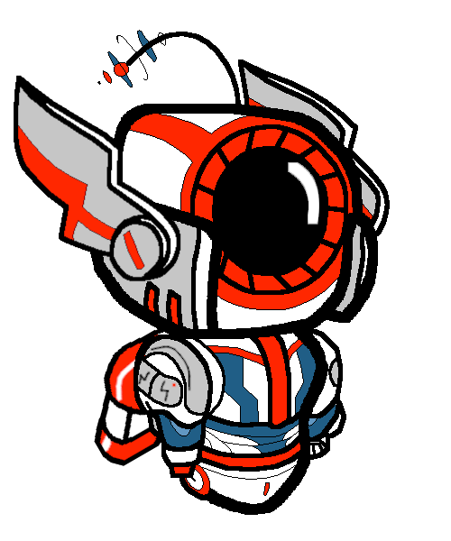

# Singularity Bot Profile

## Lineage
- Designed as a bespoke variant of Reddit's Singularity collection, specifically referencing the airdropped "The Singularity #1273726" mech.
- Retains the franchise's towering sentry stance while reinterpreting the armor stack within `assets/SingularityMain.xcf`.

## Silhouette and Proportions
- Tall, narrow frame with a tapered abdomen and long greaves that flare at the ankles for extra visual weight at ground contact.
- Minimalist helm: a slim visor plate nested beneath a high collar, keeping the head compact against the broad pauldrons.
- Shoulder pylons float slightly off the torso, exposing the conduit harness that feeds the central core.

## Materials and Palette
- Chassis: carbon-black composites across the spine, ribbing, and inner limb structure (RGB ≈ 0/0/0).
- Armor plates: alternating satin white and gunmetal facets (RGB ≈ 255/255/255 and 198/198/198) to break up the mass while staying neutral under varied lighting.
- Energy seams: incandescent ember red lines (RGB ≈ 255/39/1) running from sternum to pelvis, read as an exposed plasma channel.
- Thruster conduits: teal cabling (RGB ≈ 31/95/134) braided along the calves and outer thighs, hinting at vectored hover support.
- Accent motto from the original NFT: deep navy structural shadows (RGB ≈ 10/30/52) appear in the base artwork and inform secondary shading passes.

## Signature Elements
- Vertical energy spine segmented into three plates; the center plate houses the brightest emitter and anchors the variant's identity.
- Split chest carapace with white outer guards and a black inner keel, framing the red core while keeping an armored silhouette.
- Lower leg nacelles flare outward to form stabilizing fins; teal wiring threads around each fin before disappearing into the heel jets.
- Subtle panel etching is preserved from the original asset to maintain the collectible's etched circuitry aesthetic.

## Differentiators from "The Singularity #1273726"
- Original drop leans on cobalt plating with orange heat vents; this variant inverts that balance by elevating monochrome armor and pushing the ember core forward.
- Helm crest is simplified into a smooth shroud, trading the NFT's horned profile for a sleek reconnaissance look.
- Additional white trim across the forearms and thighs increases contrast for readability at sprite scale without losing the original's layered depth.

## Asset References
- `assets/SingularityMain.xcf` — layered master file with base mesh, plating, glow, and FX groups.
- `assets/SingularitySprite.xcf` — production crop highlighting game-ready slices of the same design.
- `docs/The_Singularity_#1273726.jpeg` — archival image of the reference mech for visual comparison.
